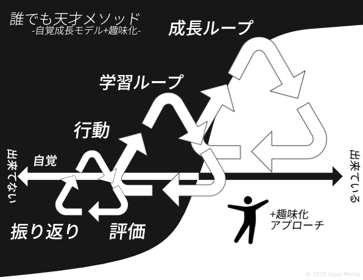

# 誰でも天才メソッド



### 1. 成長の自覚モデル

成長とは「出来なかったことが出来るようになる」と定義します。
できることが 1 つ増えたら、それが成長の証です。

---

### 2. 学習ループ

学びは **行動 → 評価 → 振り返り** の繰り返しです。

- 行動すれば結果が出る
- 結果があるから評価できる
- 評価があるから振り返れる
- 振り返ることで、次の行動を決められる

このサイクルを回すときに、「いま自分が何をできていないか」を意識する時間（＝自覚）を挟みます。
これで学びがより確かなものになります。

---

### 3. 成長ループ

学習ループを何度も重ねると、「学習の積み重ね＝成長」になります。
一歩ずつ積んでいくことで、できることがどんどん広がります。

---

### 4. 自覚成長モデル

学習ループと成長ループを、常に「自覚して取り組むもの」として認識します。
つまり、ただ繰り返すのではなく「自分がどう成長しているか」を意図的に見つめることが大事です。

---

### 5. 趣味化（自覚成長モデルを楽しみにする）

学びを「好きだからやること」に変えます。
楽しいから続けられるし、続けるから成果も出る。
意欲も効果も試す回数も、自然と増えていきます。

---

👉 このメソッドは、誰でも「できない」を「できる」に変えながら、楽しみつつ天才のように成長していく仕組みです。

---

## 有用性

### 1. 成長の自覚モデル

- **明確な定義**：「成長＝出来なかったことが出来るようになる」とシンプルに定義しているため、学習の目標や達成感が測りやすい。
- **抽象と具体の接続**：自己評価をする際に「何が出来るようになったか」で測定可能なので、自己効力感を得やすい。

### 2. 学習ループ

- **体系的な整理**：行動 → 評価 → 振り返りというサイクルは教育学や PDCA に通じる。誰でも理解しやすい。
- **自覚の挿入**：単なる PDCA との差別化が「自覚」という要素。自己の課題を見える化するので、漫然とループを回さずに済む。

### 3. 成長ループ

- **時間軸を意識**：学習ループの積み重ねを「成長ループ」としたことで、単発の試行錯誤を超えて長期的に成長を捉えられる。
- **学習資産化**：知識・経験が「次の学習」に継承される仕組みを強調できる。

### 4. 自覚成長モデル

- **全体の統合概念**：学習ループと成長ループを「意図的自覚」としてまとめたことで、メソッド全体の一貫性がある。
- **自己調整学習に近い**：教育心理学でいう「メタ認知」や「自己調整学習」と親和性が高い。

### 5. 自覚成長モデルの趣味化

- **継続性の鍵**：楽しさをベースにすることで、学習を義務から解放し、持続可能性を高められる。
- **制約からの自由**：やらされ感や失敗への恐れを減らし、試行回数を自然に増やせる。

## ケース例：プログラミング学習（Python を習得しようとする人）

### ① メソッドを使わなかった場合

- **行動**：本を買って読み進めるが、わからないところで止まる。写経でなんとなくコードを書く。
- **評価**：曖昧。「たぶん理解した」「エラー出たけどよくわからない」。
- **振り返り**：やってみたけど難しかった、向いてないかも。
- **結果**：

  - 「出来ること」が増えていない（出来なかったことが出来るようになった実感がない）。
  - 学習が楽しくないので継続せず、数週間で中断。
  - 自分の成長を把握できず、自信もつかない。

---

### ② メソッドを使った場合（誰でも天才メソッド適用）

1. **成長の自覚モデル**

   - 「出来なかったことが出来るようになる」を目標に設定。
   - 例：最初は「print 文を書けなかった → Hello World を出せるようになった」で小さな成長を確認。

2. **学習ループ**（行動 → 評価 → 振り返り＋自覚）

   - 行動：サンプルコードを書いてみる。
   - 評価：正しく出力されたか、自分で動作を確認。
   - 振り返り：なぜ動いたか・なぜエラーになったかを考える。
   - 自覚：次は「条件分岐がわからない」と課題を明確化。

3. **成長ループ**

   - 「Hello World → 条件分岐 → 繰り返し → 関数化 → 簡単なアプリ」という形で、過去の学習を積み重ねて応用。

4. **自覚成長モデル**

   - 学んだ内容を定期的に「自分は何ができるようになったか」で整理する。
   - 例：チェックリスト形式で「if 文を使える／for 文を使える／関数を作れる」などを書き出す。

5. **趣味化**

   - 小さなアプリ（ゲーム、日記アプリなど）を作って楽しむ。
   - 学習が「やらなきゃ」から「もっとやりたい」になる。

- **結果**：

  - 出来ることが段階的に増えていく実感が得られる。
  - 成長の証拠が可視化され、モチベーションが持続。
  - 最終的に「自分の欲しい簡単なツール」を作れるようになる。

---

## まとめ比較

| 項目         | 使わなかった場合       | 使った場合                       |
| ------------ | ---------------------- | -------------------------------- |
| 学習の進み方 | 行き当たりばったり     | 小さなステップで着実に           |
| 評価方法     | あいまい、感覚的       | 明確に「出来る／出来ない」で確認 |
| 振り返り     | 「難しかった」で終了   | 次に向けて課題を明確化           |
| 成長実感     | ほぼなし               | 毎回「できること」が増えて可視化 |
| 継続性       | 挫折しやすい           | 趣味化して続けやすい             |
| 成果         | 中途半端な知識で終わる | 自分のアプリや成果物を残せる     |

---

👉 この比較を見ると、「誰でも天才メソッド」は **「学びを継続できる仕組み」＋「成長を実感できる設計」** に強いことがわかります。

# 誰でも天才メソッドを生成 AI で利用するためのプロンプト

## ① 個人の自己学習用プロンプト

（自分の学びを AI と一緒に整理するためのプロンプト）

```
あなたは私の学習と成長を整理してくれるコーチです。
以下の「誰でも天才メソッド」に沿って、私が入力する学習体験を整理してください。

【誰でも天才メソッド】
1. 成長の自覚モデル：成長＝「できなかったことができるようになること」
2. 学習ループ：行動 → 評価 → 振り返り → 自覚
3. 成長ループ：学習ループを積み重ねて成長を確認
4. 自覚成長モデル：学習と成長を意識的に自覚する
5. 趣味化：楽しみながら続けられる工夫をする

私が体験を入力したら、以下の形式でまとめてください：

1. 今回できるようになったこと
2. まだできていないこと（自覚した課題）
3. 次にとるべき行動（学習ループを回すためのステップ）
4. 成長ループの積み重ねとして意識すべきこと
5. 続けたくなる工夫（趣味化のヒント）

※具体例を交えて、前向きに書いてください。
```

---

## ② 指導・研修用プロンプト

（生徒・受講者・部下などから報告を受けたときに AI で整理してあげるためのプロンプト）

```
あなたは教育者・指導者として、対象者の学びを整理し、成長を見える化する役割を持ちます。
以下の「誰でも天才メソッド」に沿って、対象者の学習体験を再構築し、理解しやすくフィードバックしてください。

【誰でも天才メソッド】
1. 成長の自覚モデル：成長＝「できなかったことができるようになること」
2. 学習ループ：行動 → 評価 → 振り返り → 自覚
3. 成長ループ：学習ループを積み重ねて成長を確認
4. 自覚成長モデル：学習と成長を意識的に自覚する
5. 趣味化：楽しみながら続けられる工夫をする

対象者の入力をもとに、以下の形式でフィードバックしてください：

1. 成長ポイント（できるようになったこと）
2. 課題ポイント（まだできていないこと）
3. 次に取り組むべきアクション（学習ループを進める行動）
4. 成長の積み重ねの位置づけ（どんな大きな成長につながるか）
5. 継続の工夫（楽しく続けるためのアドバイス）

※対象者のモチベーションを高めるトーンで、簡潔かつ具体的に書いてください。
```

---

## 実行イメージ

#### 入力例（個人が AI に入力）

「今日はオンライン英会話をやってみたけど、すぐに言葉が出なくて詰まってしまった。」

#### 出力例（AI の返答）

1. **成長ポイント**：実際に英会話に挑戦できた（行動できた）
2. **課題ポイント**：言いたいことをすぐに英語にできない
3. **次のアクション**：よく使う表現を 3 つ暗記して、会話で試す
4. **成長の積み重ね**：単なる教材学習から、実際の会話チャレンジに進めた段階
5. **継続の工夫**：自分が話したい趣味や好きな技術テーマを題材に英会話すると楽しく続けられる

---

[その他の事例:英会話学習・エンジニアスキルの習得、生成 AI 用プロンプト](https://github.com/m-ippei/anyone-genius-method/tree/main/more)

[筆者による自覚成長モデルの PDF 資料](https://github.com/m-ippei/anyone-genius-method/tree/main/author-experiences-samples/pdf)
